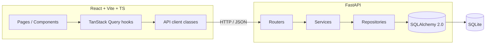

# Inventory Manager

[](https://github.com/MSeyyidDev/inventory-manager/actions/workflows/ci.yml)
[](https://www.python.org/downloads/)
[](https://nodejs.org/)
[](LICENSE)

A small but polished fullstack application to manage IT assets, the people who use them and the locations they live in.

Built as a portfolio project to showcase clean, layered backend code (FastAPI + SQLAlchemy 2.0 + Pydantic v2) and a typed, feature-organised frontend (React + TypeScript + Vite + TanStack Query + Tailwind).

---

## Features

- **Devices**: laptops, monitors, smartphones, servers and accessories with status, manufacturer, model, serial, purchase / warranty dates and notes.
- **Employees**: 200 seeded staff in 6 departments, each linked to a location.
- **Locations**: 8 offices (Berlin HQ, Munich, Hamburg, Frankfurt, Vienna, Zurich, Amsterdam, Remote).
- **Assignments**: full assign / return history per device, with timeline view.
- **CSV bulk operations**: import and export the device catalogue.
- **Stats / dashboard**: KPI cards plus charts (devices by type, status and location) using `recharts`.
- **Polished OpenAPI**: tagged routers, summaries and request examples at `/docs`.

---

## Architecture



Backend layers, each in its own package:

| Layer        | Responsibility                                 |
| ------------ | ---------------------------------------------- |
| `models/`    | SQLAlchemy 2.0 ORM entities                    |
| `schemas/`   | Pydantic v2 request/response models            |
| `repositories/` | Data access (one class per aggregate root)  |
| `services/`  | Business rules, transactions, error mapping    |
| `routers/`   | FastAPI endpoints, dependency injection        |
| `core/`      | Settings, database engine, shared enums        |

Frontend uses a feature-based layout (`src/features/devices`, `…/employees`, `…/locations`, `…/assignments`, `…/dashboard`) with shared atoms in `src/components/` and one API client class per resource in `src/api/`.

---

## Tech stack

**Backend** – Python 3.13, FastAPI, SQLAlchemy 2.0, Pydantic v2 + pydantic-settings, SQLite, Faker, pytest, httpx.

**Frontend** – React 18, TypeScript, Vite 5, Tailwind CSS, TanStack Query 5, Axios, React Router 6, Zod, Recharts, Vitest + React Testing Library.

---

## Screenshots

> `docs/screenshots/dashboard.png` · `docs/screenshots/devices.png` · `docs/screenshots/device-detail.png`
> _(placeholders – the UI runs locally on `http://localhost:5173`)_

---

## Setup

Prerequisites: Python 3.13, Node.js 20+ and `npm`.

### Backend

```bash
cd backend
python -m pip install -r requirements.txt
python -m app.seed           # generates 8 locations, 200 employees, 600 devices, 800 assignments
uvicorn app.main:app --reload --port 8000
# Swagger UI:  http://127.0.0.1:8000/docs
```

### Frontend

```bash
cd frontend
npm install
npm run dev
# Vite UI:  http://localhost:5173  (proxies /api → http://127.0.0.1:8000)
```

### Makefile shortcuts

```bash
make install        # backend + frontend
make seed           # fresh synthetic data
make dev-backend    # FastAPI on :8000
make dev-frontend   # Vite on :5173
make test           # all tests
```

---

## Tests

```bash
cd backend && pytest -q                # 41 tests
cd frontend && npm test -- --run       # 18 tests
```

The backend uses an in-memory SQLite engine per test (`tests/conftest.py`) and overrides the `get_db` dependency, so production data is never touched.

---

## API endpoints

| Method | Path                                | Description                                  |
| ------ | ----------------------------------- | -------------------------------------------- |
| GET    | `/health`                           | Liveness probe                               |
| GET    | `/stats/overview`                   | KPI counts + breakdowns for the dashboard    |
| GET    | `/devices`                          | List with filter, search, sort, pagination   |
| POST   | `/devices`                          | Create a device                              |
| GET    | `/devices/{id}`                     | Get one device                               |
| PATCH  | `/devices/{id}`                     | Partial update                               |
| DELETE | `/devices/{id}`                     | Delete                                       |
| GET    | `/devices/{id}/history`             | Full assignment timeline                     |
| GET    | `/devices/export-csv`               | Export the catalogue as CSV                  |
| POST   | `/devices/import-csv`               | Bulk import (multipart upload)               |
| GET    | `/employees`                        | List with search and pagination              |
| POST   | `/employees`                        | Create                                       |
| GET    | `/employees/{id}`                   | Get one                                      |
| PATCH  | `/employees/{id}`                   | Partial update                               |
| DELETE | `/employees/{id}`                   | Delete                                       |
| GET    | `/employees/{id}/devices`           | Active assignments for this employee         |
| GET    | `/locations`                        | List                                         |
| POST   | `/locations`                        | Create                                       |
| PATCH  | `/locations/{id}`                   | Update                                       |
| DELETE | `/locations/{id}`                   | Delete                                       |
| POST   | `/assignments`                      | Assign a device to an employee               |
| POST   | `/assignments/{id}/return`          | Mark an assignment as returned               |

Filtering for `GET /devices` accepts: `type`, `status`, `location_id`, `assigned_to`, `search`, `sort_by`, `sort_dir`, `page`, `page_size`.

---

## Sample CSV format

The CSV used by `import-csv` and `export-csv`:

```csv
type,manufacturer,model,serial_number,status,purchase_date,warranty_end,notes,location_id
laptop,Dell,Latitude 7440,DLL-7440-9F31A2,available,2024-03-12,2027-03-12,,1
monitor,LG,27UP850-W,LG-27UP-77B812,available,2023-06-01,2025-06-01,,1
smartphone,Apple,iPhone 15 Pro,APPL-15P-A12345,assigned,2024-01-15,2026-01-15,,2
```

Allowed `type` values: `laptop`, `monitor`, `smartphone`, `server`, `accessory`.
Allowed `status` values: `available`, `assigned`, `maintenance`, `retired`.

---

## License

MIT – see `LICENSE`.
